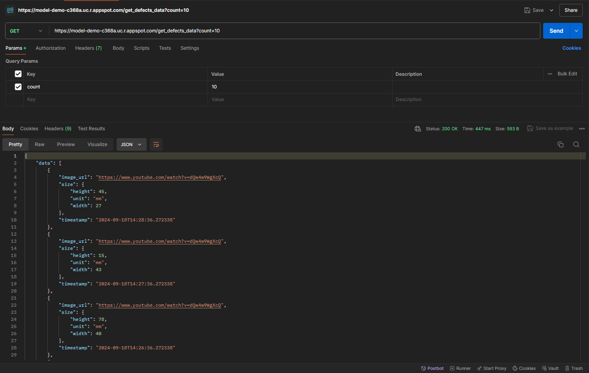

### `GET /get_defects_data`

#### Base URL
`https://model-demo-c368a.uc.r.appspot.com`

#### Description
The `/get_defects_data` endpoint generates and returns a list of defect data. Each defect includes a timestamp, an image URL, and size dimensions (width and height in millimeters).

#### Parameters
- `count` (required, integer): The number of defect records to generate.

#### Responses
- **200 OK**
  - **Content-Type:** `application/json`
  - **Body:**
    ```json
    {
      "error": null,
      "data": [
        {
          "timestamp": "2023-10-01T12:34:56.789123",
          "image_url": "https://www.youtube.com/watch?v=dQw4w9WgXcQ",
          "size": {
            "width": 42,
            "height": 58,
            "unit": "mm"
          }
        },
        ...
      ]
    }
    ```
  - **Description:** Returns a list of defect data based on the `count` parameter.

- **400 Bad Request**
  - **Content-Type:** `application/json`
  - **Body:**
    ```json
    {
      "error": "Count parameter is required",
      "data": null
    }
    ```
  - **Description:** Indicates that the `count` parameter is missing from the request.

#### Example Request
```bash
curl -X GET "https://model-demo-c368a.uc.r.appspot.com/get_defects_data?count=5"
```

#### Example Response
```json
{
  "error": null,
  "data": [
    {
      "timestamp": "2023-10-01T12:34:56.789123",
      "image_url": "https://www.youtube.com/watch?v=dQw4w9WgXcQ",
      "size": {
        "width": 42,
        "height": 58,
        "unit": "mm"
      }
    },
    {
      "timestamp": "2023-10-01T12:33:56.789123",
      "image_url": "https://www.youtube.com/watch?v=dQw4w9WgXcQ",
      "size": {
        "width": 37,
        "height": 64,
        "unit": "mm"
      }
    },
    ...
  ]
}
```

#### Example POSTMAN Request
- **Method:** GET
- **URL:** `https://model-demo-c368a.uc.r.appspot.com/get_defects_data?count=10`
- **Headers:** `Content-Type: application/json`
- **Body:** None
- **Response:** See the example response above.
- **Description:** This request generates and returns a list of 10 defect records.


